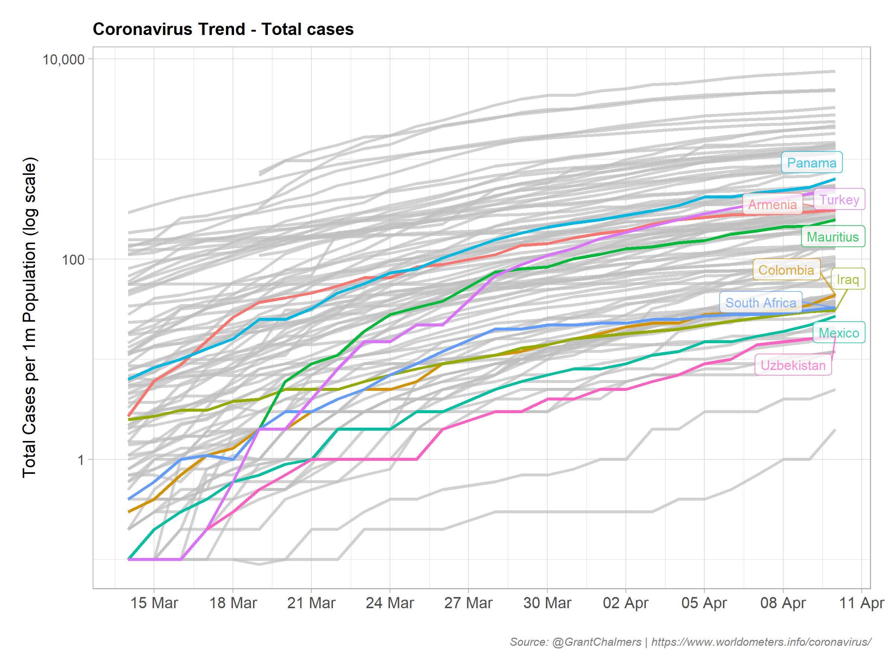

# Coronavirus R Markdown Report

Use R Markdown to create a Coronavirus Snapshot Report.


### Prerequisites

If you wish to try this out on your own, you will need R installed. I used the following libraries:

| Library  | Rationale |
| :---------- | :-------------------------------------------------------------------- |
| `rvest`      | webscraping                                                          |
| `janitor`    | clean column names                                                   |
| `tidyverse`  | reading in data, general manipulation of data and plotting (ggplot2) |
| `gghighlight`| used to highlight certain lines in geom_line                         |
| `httr`       | calling API from a URL                                               |
| `jsonlite`   | manipulating JSON structure                                          |
| `lubridate`  | manipulating dates                                                   |
| `scales`     | manipulating ggplot scales                                           |


### Tips

I have used gghighlight to highlight Australia in some plots. Please fee free to delete or update to your own country of interest.

```
gghighlight(country == "Australia", unhighlighted_colour = "gray75")
```

In the below example, I have randomly chosen 9 out of the top 100 fastest growing countries in relation to new cases:

```
ggghighlight(country %in% sample(top_100_new_cases, 9)
```



### Report Communication

I use the below script to send myself and family/friends an email with RMarkdown HTML file attached every morning at 6am. This provides a dual function by also writing each days data to csv file, which is also read in for the time series trend plot (line_plot chunk) via the purrr function map_df & read_csv. 

I use Windows task scheduler, however you may use any tool you prefer.

```
library(rmarkdown)
library(mailR)

# required to get pandoc to work properly when using Windows to schedule
# https://beta.rstudioconnect.com/content/3132/Job_Scheduling_R_Markdown_Reports_via_R.html
Sys.setenv(RSTUDIO_PANDOC="C:/Program Files/RStudio/bin/pandoc")

# Clean up old file if it exists
# Assign filename
fn <- "coronavirus.html"

if (file.exists(fn)) {
  file.remove(fn)
}

# Render a single format, weekly report to email myself
render("coronavirus.Rmd", "html_document")

# If the above worked, email to myself
if (TRUE %in% (list.files() == fn)) {
  # Send email to myself with plots attached.
  print("email")
  send.mail(from = "<xx.com>",
            to = c("<xxx.com>"),
            bcc = c("<xxx.com>",
                    "<xxx.com>",
                    "<xxx.com>"),
            subject = "Coronavirus Snapshot",
            body = "6am AEST Coronavirus Snapshot, send return email if you want to opt out!",
            smtp = list(host.name = "xxx.com", ssl = TRUE,
                        user.name = "xxx",
                        passwd = "xxx"),
            authenticate = TRUE,
            send = TRUE,
            attach.files = fn,
            debug = TRUE)
} 

```

## Authors

* **Grant Chalmers** [Twitter profile](https://twitter.com/GrantChalmers)


## Acknowledgments

* Jennifer Cooper for the [LinkedIn post](https://www.linkedin.com/posts/jennifermariecoopermba_instructions-to-pull-coronavirus-stats-from-ugcPost-6639362773132333056-BR1_) explaining webscraping in R in simple terms.
* Infotorch for providing a simple [API](https://api.infotorch.org/api/covid19/statlist/?geos=NSW,VIC,QLD,WA,SA,TAS,ACT,NT&stat=confirmed) to play with.
* [Worldmeters](https://www.worldometers.info/coronavirus/) for providing HTML table to scrap.

